# **Лабораторная №1. Loki + Zabbix + Grafana**
## Часть 1. Логирование
Провели базовую настройку всех нужных файлов для корректной работы с Docker

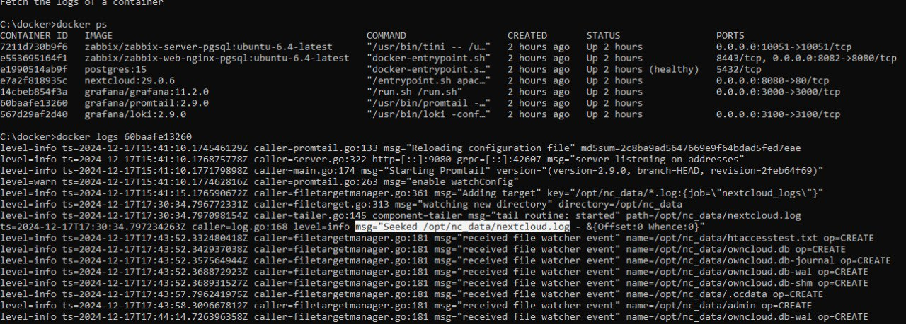

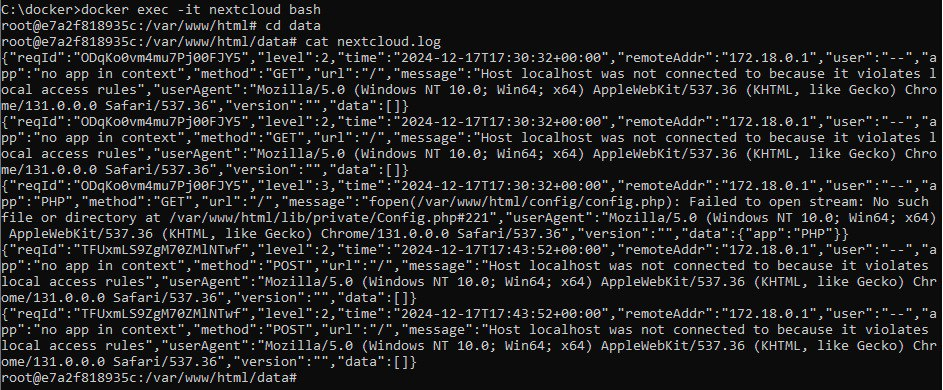

## Часть 2. Мониторинг
1. Подключились к Zabbix через креды
2. Импортировали кастомный шаблон для мониторинга nextcloud.
3. Чтобы Zabbix и Nextcloud могли общаться по своим коротким именам внутри докеровской сети, в некстклауде “разрешили” это имя. Для этого нужно зашли на контейнер некстклауда под юзером www-data и выполнили команду php occ config:system:set trusted_domains 1 --value="nextcloud":

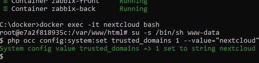

4. Добавили Hosts в Zabbix для Nextcloud:
   
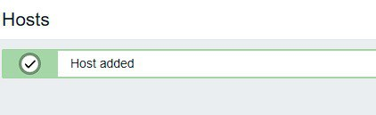

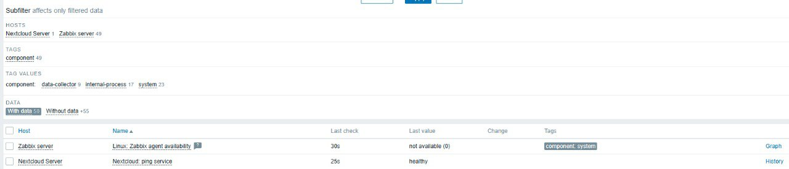

## Часть 3. Визуализация
1. Выполнили команды для Grafana
2. Зашли в графану (по умолчанию http://localhost:3000/), раздел Administration → Plugins. Нашли там Zabbix, активировали его (Enable):

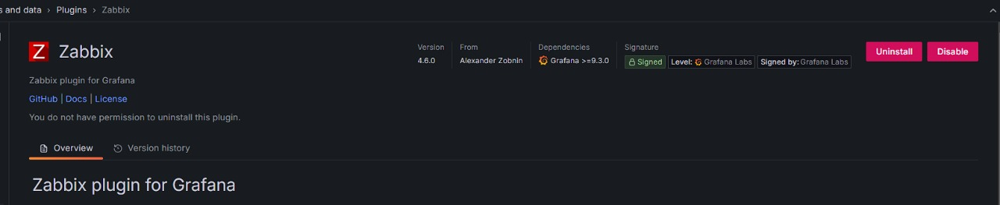

3. Подключаем Loki к Grafana, раздел Connections → Data sources → Loki. В настройках подключения указали любое имя и адрес http://loki:3100:

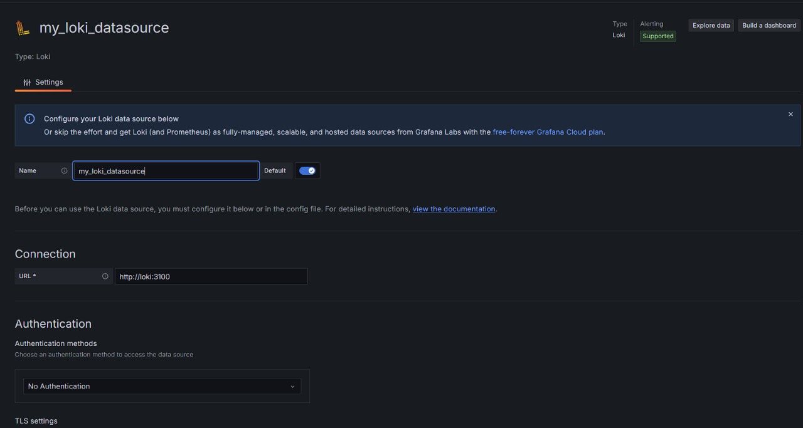

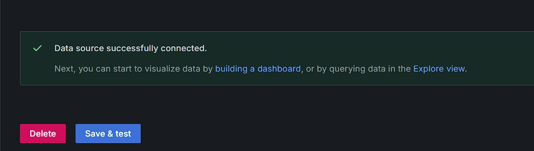

4. Проверили работоспособность Zabbix:

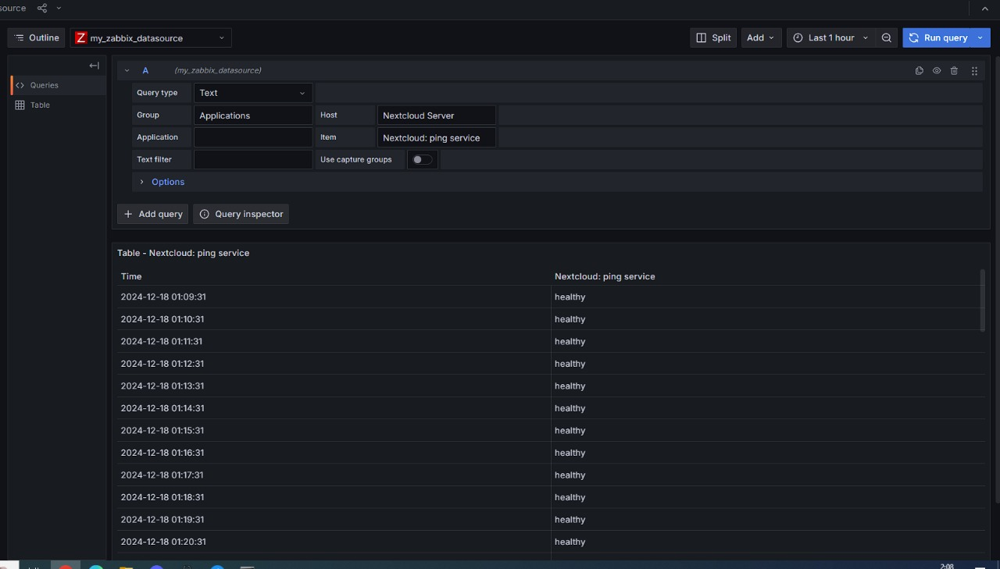

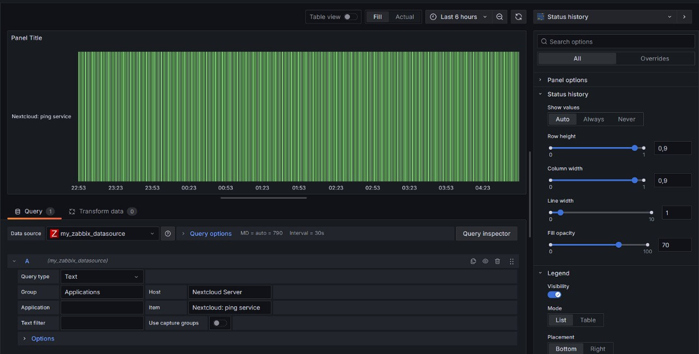

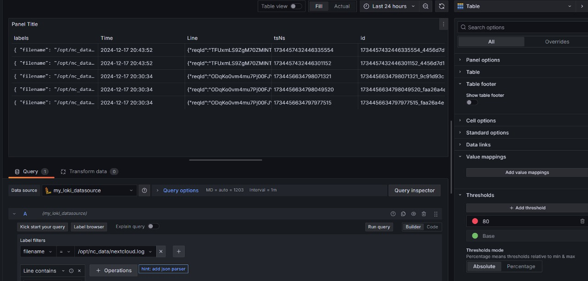

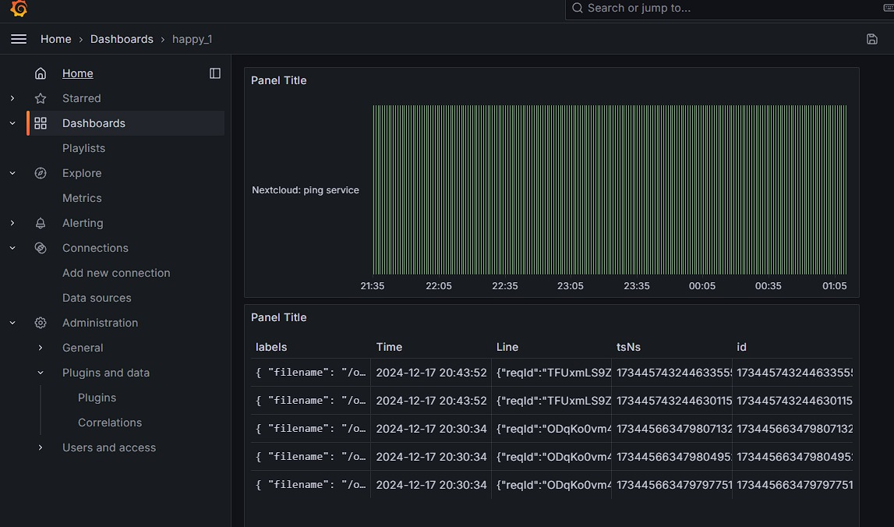
