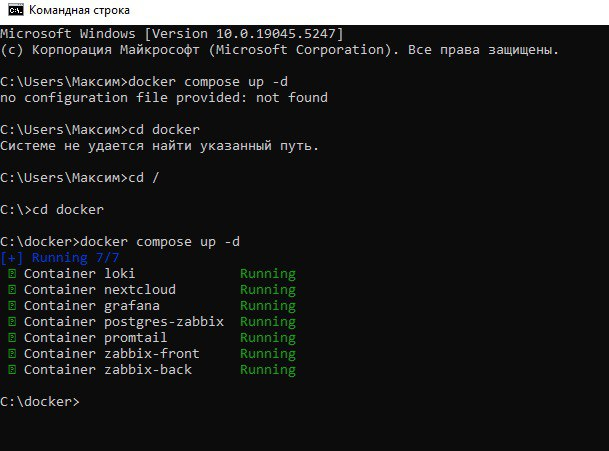

# **Лабораторная №1. Loki + Zabbix + Grafana**
## Часть 1. Логирование
Провели базовую настройку всех нужных файлов для корректной работы с Docker

## Часть 2. Мониторинг
1. Подключились к Zabbix через креды
2. Импортировали кастомный шаблон для мониторинга nextcloud.
3. Чтобы Zabbix и Nextcloud могли общаться по своим коротким именам внутри докеровской сети, в некстклауде “разрешили” это имя. Для этого нужно зашли на контейнер некстклауда под юзером www-data и выполнили команду php occ config:system:set trusted_domains 1 --value="nextcloud":

4. Добавили Hosts в Zabbix для Nextcloud:
   

## Часть 3. Визуализация
1. Выполнили команды для Grafana
2. Зашли в графану (по умолчанию http://localhost:3000/), раздел Administration → Plugins. Нашли там Zabbix, активировали его (Enable):

3. Подключаем Loki к Grafana, раздел Connections → Data sources → Loki. В настройках подключения указали любое имя и адрес http://loki:3100:

4. Проверили работоспособность Zabbix:

## Ответы на вопросы:
1. Чем SLO отличается от SLA? SLO — это внутренняя цель качества услуги, а SLA — внешнее обязательство с клиентом, подкреплённое договором.
2. Чем отличается инкрементальный бэкап от дифференциального? Инкрементальный бэкап сохраняет изменения с момента последнего бэкапа (любого типа), а дифференциальный — изменения только с момента последнего полного бэкапа.
3. В чем разница между мониторингом и observability? Мониторинг — это отслеживание заранее определённых метрик и событий, а observability — способность системы предоставлять детализированную информацию для анализа её состояния и причин неисправностей без заранее заданных предположений.Т.е. мониторинг информирует о том, что происходит, а observability следит и сообщает почему что-то произошло и как
